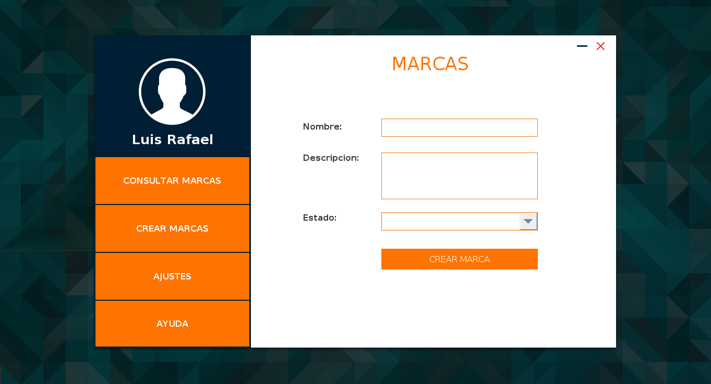

# Crunchy cafeteria
<h1 style="font-family: Arial; text-align: center">Crunchy cafeteria</h1>
<h2>Descripcion</h2>  
     
 

  Este es un proyecto de punto de ventas y gestión de inventarios para una cafetería, tiene como objetivo permitirle a los empleados despachar productos existentes en un almacén y gestionar inventarios.

<h2>Tecnologias usadas<h2>
  <h3 style="display: inline; font-family: Arial">Lenguaje de programacion:</h3>
 
  

  <ul> 
    <li>Java</li>
  </ul>
  

 

 
 <h3 style="display: inline; font-family: Arial">Librerias:</h3>
  
  
 
    <ul>
      <li>Swing</li>
    </ul>
  

  
   <h3 style="display: inline; font-family: Arial">Proveedor de Persistencia:</h3>
  
  
 
    <ul>
      <li>JPA</li>
    </ul>
  

  
 
  <h3 style="display: inline; font-family: Arial">Gestor de base de datos:</h3>
  
  
 
    <ul>
      <li>MySQL</li>
    </ul>
  

  
 <h3 style="display: inline; font-family: Arial">IDE:</h3>
  
  
 
    <ul>
      <li>NetBeans</li>
    </ul>
  

  
   
  <h3 style="display: inline; font-family: Arial">Pantalla de iniciar sesion</h3>
 

 
  <h3 style="display: inline; font-family: Arial">Pantalla de registro</h3>
 

 
  <h3 style="display: inline; font-family: Arial">Validacion de los campos</h3>
 

 
  <h3 style="display: inline; font-family: Arial">Pantalla de inicio</h3>
 

 
  <h3 style="display: inline; font-family: Arial">Pantalla para crear marcas</h3>
 

 
  <h3 style="display: inline; font-family: Arial">Pantalla para crear marcas</h3>
 

 
  <h3 style="display: inline; font-family: Arial">Pantalla para consultar marcas</h3>
 

 
 

Estas son algunas capturas del proyecto en funcionamiento

